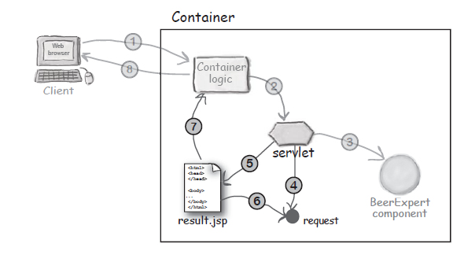
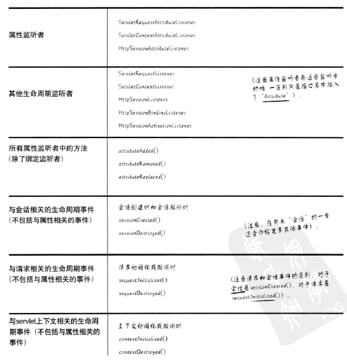
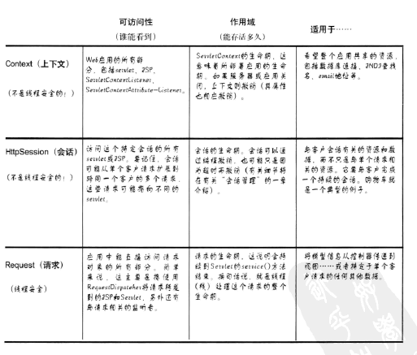
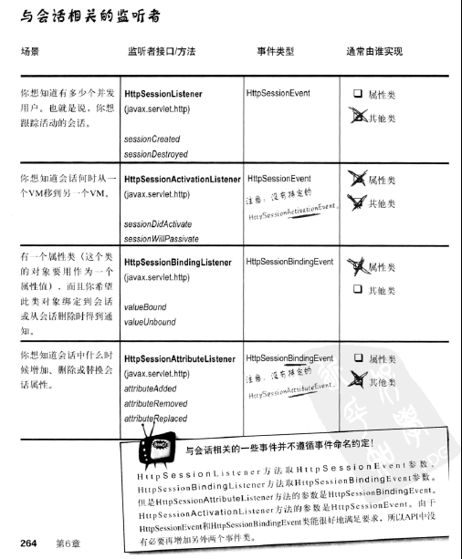
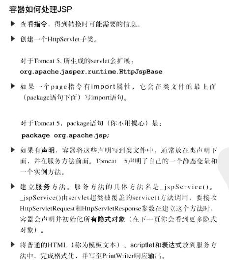
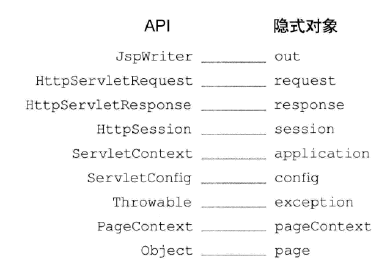

# JSP/Servlet笔记

[TOC]

## 1 Web容器

### 1.1 容器能提供什么？

1. 通信支持
2. 生命周期管理
3. 多线程支持
4. 声明方式实现安全
5. JSP支持

### 1.2 容器处理请求

1. 用户点击一个链接，URL指向一个Servlet，而不是一个静态页面
2. 容器识别出是指向Servlet的请求，所以创建出两个对象**HttpServletResponse** 和 **HttpServletRequest** 
3. 容器根据请求中的URL找出对应的Servlet，为这个请求**创建或分配一个线程**，并将请求和响应对象传递给这个Servlet线程
4. 容器调用Servlet的`service()`方法，根据请求的不同类型会调用`doGet()`和`doPost()`方法
5. `doGet() `方法生成动态页面，填入响应对象，同时容器还有响应对象的一个引用
6. 线程结束，容器把响应对象**转换**为一个HTTP响应把它发回给客户，同时删除请求和响应对象

完整的Servlet示例

```java
// 导入必需的 java 库
import java.io.*;
import javax.servlet.*;
import javax.servlet.http.*;

// 扩展 HttpServlet 类
public class HelloWorld extends HttpServlet {
 
  private String message;

  public void init() throws ServletException
  {
      // 执行必需的初始化
      message = "Hello World";
  }

  public void doGet(HttpServletRequest request,
                    HttpServletResponse response)
            throws ServletException, IOException
  {
      // 设置响应内容类型
      response.setContentType("text/html");

      // 实际的逻辑是在这里
      PrintWriter out = response.getWriter();//在servlet从容器中拿到的响应对象中可以获取一个PrintWriter
      out.println("<h1>" + message + "</h1>");
  }
  
  public void destroy()
  {
      // 什么也不做
  }
}
```

### 1.3 Servlet的映射

一个Servlet有3个名字：客户知道的URL、部署名、真实路径名

部署

```xml
<web-app ...>
	<servlet>
		<servlet-name>Internal name 1</servlet-name>
		<servlet-class>foo.Servlet1</servlet-class>
	</servlet>
  	<servlet>
		<servlet-name>Internal name 2</servlet-name>
		<servlet-class>foo.Servlet2</servlet-class>
	</servlet>
	<servlet-mapping>
		<servlet-name>Internal name 1</servlet-name>
		<url-pattern>/Public1</url-pattern>
	</servlet-mapping>
	<servlet-mapping>
		<servlet-name>Internal name 2</servlet-name>
		<url-pattern>/Public2</url-pattern>
	</servlet-mapping>
</web-app>
```

`<servlet-name>`元素用于把一个`<servlet>`绑定到一个特定的`<servlet-mapping>`元素，最终用户绝对看不到这个名，这个名只在这个部署描述文件的其他部分使用。

`<servlet-mapping>`，请求到来时，容器会在运行时使用这个容器询问*对于这个URL应该调用哪个Servlet*。

`<url-pattern>`是客户看到并使用的名称，可以使用通配符，是相对于上下文菜单`ContextPath()`的相对路径。

form中的`action="xxx.do"`是一个逻辑名而不是一个文件名，是客户使用的名字，在部署描述文件web.xml中会把客户请求资源`"xxx.do"`映射到一个实际的Servlet类文件。

#### Servlet3.0 注解

Servlet3.0 注解新特性免去web.xml配置，容器会根据web.xml中的metadata-complete元素的值来决定使用web.xml还是使用注解。如果该元素的值是true，那么容器不处理注解，web.xml是所有信息的来源。如果该元素不存在或者其值不为true，容器才会处理注解。

```java
@WebServlet(
		description = "Point to a JSP file", 
		urlPatterns = { "/ShowServlet" }, 
		initParams = { 
				@WebInitParam(name = "kehu", value = "kehuduan")
		})
```


### 1.4 简单的MVC过程

1 - The browser sends the request data to the Container.
2 - The Container finds the correct servlet based on the URL, and passes the request to the servlet.
3 - The servlet calls the BeerExpert for help.
4 - The expert class returns an answer, which the servlet adds to the request object.
5 - The servlet forwards the request to the JSP.
6 - The JSP gets the answer from the request object.
7 - The JSP generates a page for the Container.
8 - The Container returns the page to the happy user.



### 1.5 Servlet 生命周期

```sequence
Title:Servlet生命周期
容器-->Servlet类:加载类
容器-->Servlet对象:初始化Servlet（构造函数运行）
容器-->Servlet对象:init():servlet一生只调用一次
容器-->Servlet对象:service()：Servlet一生主要在这里度过
Note right of Servlet对象:doGet()、doPost()等
容器-->Servlet对象:destroy()：只能调用一次
```

## 2 会话和请求

### 2.1 监听器



注解

```
@WebListener 
@WebListener注解被应用在作为listener监听web应用程序事件的类上.
```


### 2.2 作用域



### 2.3 会话管理

HttpSession 接口  关键方法

```java
getAttribute();
setAttribute();
removeAttribute();
getCreationTime();//返回第一次创建会话的时间
getLastAccessedTime();//容器最后一个获得这个会话过去了多长时间(ms)
setMaxInactiveInterval();//指定对于这个会话客户请求的最大间隔(s)
getMaxInactiveInterval();
invalidate();//结束会话
```



## 3 JSP

### 3.1 容器如何处理JSP



隐式对象与API的对应关系图



### 3.2 JSP生命周期

理解**JSP底层功能**的关键就是去理解它们**所遵守的生命周期**。

JSP生命周期就是从创建到销毁的整个过程，类似于servlet生命周期，区别在于JSP生命周期还包括**将JSP文件编译成servlet**。

 以下是JSP生命周期中所走过的几个阶段：

- **编译阶段：**

  **servlet容器**编译servlet源文件，生成servlet类

- 初始化阶段：

  加载与JSP对应的servlet类，创建其实例，并调用它的初始化方法

- 执行阶段：

  调用与JSP对应的servlet实例的服务方法

- 销毁阶段：

  调用与JSP对应的servlet实例的销毁方法，然后销毁servlet实例

很明显，JSP生命周期的**四个主要阶段**和servlet生命周期非常相似，下面给出图示：

 

**1.JSP编译**

当浏览器请求JSP页面（通过浏览器浏览URL？）时，**JSP引擎（？）**会首先去检查是否需要**编译**这个文件。如果这个文件没有被编译过，或者在上次编译后被更改过，则编译这个JSP文件。（转为且编译servlet）

编译的过程包括三个步骤：

- 解析JSP文件。
- 将JSP文件转为servlet。
- 编译servlet。

**2.JSP初始化**

**容器（？）**载入JSP文件后，它会在为请求提供任何服务**前**调用`jspInit()`方法。如果您需要执行自定义的**JSP初始化任务**，复写`jspInit()`方法就行了，就像下面这样：

```
public void jspInit(){
  // 初始化代码
}
```

一般来讲**程序只初始化一次**，servlet也是如此。通常情况下您可以**在jspInit()方法中**初始化数据库连接、打开文件和创建查询表。

 

**3.JSP执行**

这一阶段描述了JSP生命周期中一切与请求相关的交互行为，直到被销毁。

当**JSP网页完成初始化**后，**JSP引擎（？）**将会调用`_jspService()`方法。

`_jspService()`方法需要一个**HttpServletRequest对象**和一个**HttpServletResponse对象**作为它的参数，就像下面这样：

```
void _jspService(HttpServletRequest request,
                 HttpServletResponse response)
{
   // 服务端处理代码
}
```

`_jspService()`方法在**每个request中（？）**被调用一次并且**负责产生**与之相对应的response，并且它还负责**产生**所有7个HTTP方法的回应**（?）**，比如GET、POST、DELETE等等。**\*(这过程不懂？)***

**4.JSP清理**

JSP生命周期的销毁阶段描述了当**一个JSP网页从容器中被移除**时所发生的一切。

`jspDestroy()`方法在JSP中等价于servlet中的销毁方法。当您需要执行任何清理工作时复写`jspDestroy()`方法，比如释放数据库连接或者关闭文件夹等等。

`jspDestroy()`方法的格式如下：

```
public void jspDestroy()
{
   // 清理代码
}
```

### 3.3 JSP动作

创建bean

```jsp
<jsp:useBean id = "person" class= "foo.class" scoper="request">
  <jsp:setProperty name = "person" property="name" value="Fred"/>
  <%--只有新建bean才会运行jsp:setProperty语句--%>
</jsp:useBean>
```

### 3.4 EL表达式

EL表达式支持的隐式对象

```
pageScope
requestScope
SessionScope
applicationScope//作用域属性的Map

param
paramValues//请求参数的map

header
headerValues//请求首部的map

cookie

initParam//上下文初始化参数的map

PageContext 除了PageContext之外都是Map对象
```

Using the dot (.) operator to access properties and map values